# convert_hitboxes.py — Function Reference

Converts Project M hitbox script data into Rivals 2 JSON format.
Each run produces numbered output files in a subfolder named after the move.

**Output files by pipeline:**
| # | File | Regular | Angled | Charged | Charged+Angled | Grab | Start/End |
|---|------|---------|--------|---------|----------------|------|-----------|
| 01 | `Animations.txt` | ✓ | ✓ | ✓ | ✓ | ✓ | ✓ |
| 02 | `AttackProperties.txt` | ✓ | ✓ | ✓ | ✓ | ✓ | ✓ |
| 03 | `Windows.txt` | ✓ | ✓ | ✓ | ✓ | ✓ | ✓ |
| 04 | `Hitboxes.txt` | ✓ | ✓ | ✓ | ✓ | ✓ | — |
| 05 | `ThrowData.txt` | — | — | — | — | ✓ | — |

**Pipeline selection (checked in this order):**
1. `--angled --charged` both flags → charged+angled pipeline (9 windows, 5 blocks)
2. `--angled` flag → angled pipeline (7 windows, 3 concatenated variants)
3. `--charged` flag → charged pipeline (5 windows, 3 blocks)
4. `"start"` or `"end"` in move name → start/end pipeline (single window, no hitboxes)
5. `CreateGrabBox` in input → grab pipeline
6. Otherwise → regular pipeline

---

## Constants

| Name | Value | Notes |
|------|-------|-------|
| `UNIT_SCALE` | `10.666` | Multiplier converting PM units to R2 units |
| `TRAJECTORY_SAKURAI` | `361` | PM sentinel for Sakurai (auto) angle |
| `SAKURAI_R2_ANGLE` | `45` | R2 equivalent of the Sakurai angle |
| `DEFAULT_LANDING_LAG_FRAMES` | `7` | Used when not specified in input or CLI |
| `GRAB_HOLD_FRAMES` | `60` | Duration of the Hold window in grab moves |
| `GRAB_HOLD_ANIM_FRAMES` | `120` | Animation length for Hold window |
| `GRAB_RELEASE_FRAMES` | `32` | Duration of the Release window in grab moves |
| `GRAB_RELEASE_VELOCITY_X` | `-12.5` | **Character-specific** — edit manually per character |

**Fixed R2 struct strings** (used verbatim in output):
`MOVEMENT_PROPS`, `ADVANCED_WINDOW_PROPS`, `LEDGE_PROPS`, `ADV_ON_HIT_PROPS`

`GRAB_ADV_WINDOW_PROPS` — same as `ADVANCED_WINDOW_PROPS` but with `WindowArmor=0` instead of `-1`.

---

## Helpers

### `ff(v) -> str`
Formats a float to 6 decimal places (`f"{v:.6f}"`).

### `load_bones(csv_path) -> (dict, dict)`
Parses `bones.csv` into two dicts: `{index: name}` and `{name: parent_name}`.
Parent is `""` when the bone's parent is the root (`"Bones"`).

### `parse_hitbox_args(s) -> dict`
Parses a `CreateHitBox(HitBoxArguments {...})` argument string.
Returns keys: `bone_index`, `hitbox_id`, `damage`, `trajectory`, `wdsk`, `kbg`, `bkb`,
`size`, `x_offset`, `y_offset`, `z_offset`, `ground`, `aerial`, `is_grab_box` (always `False`).

### `parse_grabbox_args(s) -> dict`
Parses a `CreateGrabBox(GrabBoxArguments {...})` argument string.
Returns the same keys as `parse_hitbox_args` but with `is_grab_box=True` and
`damage/trajectory/wdsk/kbg/bkb` all zeroed (grab hitboxes have no knockback data in PM).

### `is_grab(text) -> bool`
Returns `True` if the input text contains `CreateGrabBox`. Used to branch between
the regular attack pipeline and the 5-window grab pipeline.

---

## PM Script Parsing

### `extract_move_name(text) -> str | None`
Returns the move name from line 1 of the input if it is not a PM command.
Returns `None` if the first non-blank line looks like a PM command.

### `extract_file_params(text) -> (int | None, int | None)`
Returns `(total_frames, landing_lag_frames)` from line 2 of the input.
- `"N, M"` → both values
- `"N"` → `total_frames` only; `landing_lag_frames` returns `None`
- Anything else → `(None, None)`

### `split_angled_blocks(text) -> list[str]`
Splits a concatenated 3-variant input file into three text blocks (forward, down, up).
A new block begins whenever a non-PM-command line appears after at least one PM command has been seen — i.e., after each `AllowInterrupts`. Returns a list of 3 strings; `main()` errors out if the count is not exactly 3.

### `split_charged_blocks(text) -> list[str]`
Splits a concatenated multi-animation input file into blocks by detecting move name headers.
A line is a move name header if it matches `^[A-Z][A-Za-z0-9]+$` and is not a bare PM keyword (`DeleteAllHitBoxes`, `DeleteAllGrabBoxes`, `AllowInterrupts`). Lines before the first move name header (description/preamble) are discarded. This approach handles unknown commands like `ExternalGraphicEffect`, `GraphicEffect`, `loop Infinite times:` without needing to whitelist them. Returns a list of 3 strings; `main()` errors out if the count is not exactly 3.

### `parse_pm(text, bones, bone_parents) -> dict`
Main PM script parser. Walks the script line by line, advancing a frame counter
with `AsyncWait`/`SyncWait`, and records hitbox/grabbox snapshots.

Returns:
```python
{
    "startup_frames": int,            # frame of first CreateHitBox/CreateGrabBox
    "active_end": int,                # frame of last DeleteAll* command
    "allow_interrupts": int | None,   # frame of AllowInterrupts / EnableActionTransition
    "snapshots": list[dict],          # one entry per CreateHitBox/CreateGrabBox line
    "delete_frames": list[int],       # frames of each DeleteAll* command
}
```

---

## Phase & Hitbox Grouping

### `build_phases(data) -> list[dict]`
Groups snapshots into phases based on which frame they occur on.
Each distinct hitbox frame becomes a phase (`"Early"`, `"Late"`, `"Late2"`, `"Late3"`).
Duration = frames until the next phase starts or the next `DeleteAll*`.

Each phase dict:
```python
{
    "label": str,           # "Early", "Late", etc.
    "start_rel": int,       # frames after startup
    "duration": int,
    "hitboxes": list[dict]  # one per snapshot in this phase
}
```

Hitbox names:
- **Regular**: `"{BoneName} {label}"` — number suffix added if multiple hitboxes share the same bone
- **Grab**: `"Grab 1"`, `"Grab 2"` etc. — rename to `"Grab Front"` / `"Grab Back"` manually after export
- **Angled**: suffixed with variant after `build_phases` via `_rename_phases_for_variant` (e.g. `"Foot Early Fwd"`)

### `build_on_hit_props(phases) -> (list[dict], dict)`
Deduplicates hitbox knockback parameters into named `OnHitProperties` entries.
Two hitboxes with identical `(damage, bkb, kbg, wdsk, trajectory)` share one prop.
Runs KB values through `calc_rivals2_kb` for the PM → R2 conversion.

Returns `(on_hit_props_list, hitbox_name_to_prop_name_dict)`.

---

## Output Generators

### `build_anim_path(move_name, char_code, mod_id) -> str`
Builds the R2 animation asset reference string:
`/Script/Engine.AnimSequence'/Game/ModContent/{mod_id}/UnrealAssets/Animation/AN_{char_code}_{move_name}.AN_{char_code}_{move_name}'`

### `gen_animations(move_name, char_code, mod_id) -> dict`
Generates `01_Animations.txt` content.
- Aerial moves (`"air"` in name): `AerialAnimation` filled, `GroundedAnimation` empty
- Grounded moves: `GroundedAnimation` filled, `AerialAnimation = "None"`

### `gen_attack_properties(move_name, startup_frames, landing_lag_frames, char_code, mod_id) -> dict`
Generates `02_AttackProperties.txt` content.

Key rules:
- `Groundedness`: `"AirOnly"` if `"air"` in move name, else `"GroundOnly"`
- `LandingLagFrames` / `LandingLagAnimation`: real values for aerials, `"0"` / `"None"` otherwise
- `RootedType`: `"Rooted"` for grounded, `"None"` for aerials
- `EndInCrouchWhenGrounded`: `True` only when `"lw3"` is in the move name (down-tilt)

---

## Window Builder — Shared Helpers

These are used across all pipelines that produce `03_Windows.txt`. Prefixed with `_`.

### `_cancel_full(ctype, cancel_frame, post_key) -> str`
Full struct string for one `WindowCancels` entry.
`ctype` examples: `"UpDown"`, `"DownDown"`, `"OnGrab"`, `"OnThrow"`.

### `_hbw_short(hb_windows) -> str`
Compact `HitboxWindows` array string (omits zero `StartFrame`/`LengthInFrames`).

### `_hbw_full(hb_windows) -> str`
Full `HitboxWindows` array string (always includes all fields).

### `_window_short(name, length, anim_start, anim_length, next_name, iasa, hb_windows, window_cancels=None) -> str`
One-line summary string for a window (used in the top-level `Windows=(...)` array).
Omits default/zero fields. When `window_cancels` is a list of cancel dicts, emits a compact `WindowCancels=(...)` entry.

### `_window_full(name, length, anim_start, anim_length, next_name, iasa, hb_windows, window_cancels=None) -> str`
Complete struct string for a window including all fields with their defaults.
When `window_cancels` is provided, emits the full cancel structs inline.

### `_window_tagged_entries(idx, name, length, anim_start, anim_length, next_name, iasa, hb_windows, window_cancels=None) -> list`
All `["key", "value"]` tagged pairs for one window (`Windows.Windows[N]` and all sub-keys).
When `window_cancels` is provided, also emits `WindowCancels`, `WindowCancels.WindowCancels[N]`, and all sub-key entries for each cancel.

Cancel dict format: `{"type": str, "frame": int, "post_key": str}`

---

## Window Builder — Regular Attacks

### `_build_win_defs(data, phases, total_frames) -> list[tuple]`
Computes the ordered list of window definitions as 7-tuples:
`(name, length, anim_start, anim_length, next_name, iasa, hb_windows)`

- **Single phase**: 3 windows — Startup, Active, Recovery
- **Multi-phase**: Startup + (Active N + optional Between N) × phases + Recovery
  - Between windows only inserted when frame gap between phases > 0; numbered sequentially.

### `gen_windows(data, phases, total_frames) -> dict`
Generates `03_Windows.txt` for regular (non-grab) attacks.

### `gen_start_windows(move_name, total_frames) -> dict`
Single window for start animations: `StringTableKey` = move name, no hitbox windows.

### `gen_end_windows(move_name, total_frames, iasa) -> dict`
Single window for end animations: `StringTableKey` = move name, `IasaFrame` from `AllowInterrupts`.

---

## Window Builder — Angled Attacks

Used when `--angled` is passed. Produces 7 windows with direction cancels on Startup branching to per-variant Active/Recovery pairs.

**Animation layout:** The Blender merge script concatenates three animations sequentially (no overlap), so offsets are:
- Forward: `0`
- Down: `total_frames`
- Up: `2 × total_frames`

**Window order:** Startup → Active → Recovery → Active Down → Recovery Down → Active Up → Recovery Up

**Startup WindowCancels:** `UpDown → "Active Up"` and `DownDown → "Active Down"`, both at `WindowCancelFrame = startup_frames`.

### `_rename_phases_for_variant(phases, suffix)`
Appends a suffix to every hitbox name in `phases` in-place.
Called before combining three variants' phases: suffixes are `"Fwd"`, `"Dn"`, `"Up"`.

### `_build_angled_win_defs(data_fwd, data_dn, data_up, phases_fwd, phases_dn, phases_up, total_frames) -> list[tuple]`
Returns 7 window definitions as 8-tuples:
`(name, length, anim_start, anim_length, next_name, iasa, hb_windows, window_cancels)`
Only the Startup tuple has a non-None `window_cancels`.

### `gen_angled_windows(data_fwd, data_dn, data_up, phases_fwd, phases_dn, phases_up, total_frames) -> dict`
Generates `03_Windows.txt` for angled attacks.

---

## Window Builder — Charged+Angled Attacks

Used when both `--charged` and `--angled` are passed. Produces 9 windows from five source animations (pre-charge, charge loop, fwd/dn/up smash variants).

**Input:** 5 blocks — `AttackS4Start`, `AttackS4Hold`, `AttackS4S`, `AttackS4Lw`, `AttackS4Hi`

**Animation layout:** Sequential concatenation across all 5 animations.

**Window order:** Pre-Charge → Charge → Post-Charge → Active → Recovery → Active Down → Recovery Down → Active Up → Recovery Up

**Charge WindowCancels:** `StrongReleased` at frame 0 → `"Post-Charge"`.

**Post-Charge WindowCancels:** `DownDown` and `UpDown` at `WindowCancelFrame = post_charge_len` (= startup of the smash script) → `"Active Down"` and `"Active Up"`. The down/up variants skip directly to their own Active window; there is no separate Post-Charge per variant (same pose assumed for all angles).

**Usage:**
```
python convert_hitboxes.py temp_attack.txt --move-name AttackS4F --charged --angled
```

### `_build_charged_angled_win_defs(data_fwd, data_dn, data_up, phases_fwd, phases_dn, phases_up, start_frames, hold_frames, smash_fwd_frames, smash_dn_frames, smash_up_frames) -> list[tuple]`
Returns 9 window definitions as 8-tuples:
`(name, length, anim_start, anim_length, next_name, iasa, hb_windows, window_cancels)`
Charge and Post-Charge tuples have non-None `window_cancels`. Active windows for each variant use hitbox names suffixed `Fwd`/`Dn`/`Up`.

### `gen_charged_angled_windows(...) -> dict`
Generates `03_Windows.txt` for charged+angled smash attacks.

---

## Window Builder — Charged Attacks

Used when `--charged` is passed. Produces 5 windows from three source animations (pre-charge, charge loop, smash).

**Animation layout:** Sequential concatenation (no overlap):
- Pre-Charge: `0` → `start_frames`
- Charge: `start_frames` → `start_frames + hold_frames`
- Post-Charge / Active / Recovery: mapped from smash script offsets within `start_frames + hold_frames`

**Window order:** Pre-Charge → Charge → Post-Charge → Active → Recovery

**Charge WindowCancels:** `StrongReleased` at `WindowCancelFrame=0` (available immediately), targeting `"Post-Charge"`.

**Post-Charge length** = `startup_frames` of the smash script (the `AsyncWait` before the first hitbox).

**Recovery IASA** = `allow_interrupts` − `active_end` (both from the smash script, frame-relative).

### `_build_charged_win_defs(data_smash, phases, start_frames, hold_frames, smash_frames) -> list[tuple]`
Returns 5 window definitions as 8-tuples:
`(name, length, anim_start, anim_length, next_name, iasa, hb_windows, window_cancels)`
Only the Charge tuple has a non-None `window_cancels`.

### `gen_charged_windows(data_smash, phases, start_frames, hold_frames, smash_frames) -> dict`
Generates `03_Windows.txt` for charged smash attacks.

---

## Hitbox Builder

### `_hitbox_full_struct(hb, prop_name, interp_mode) -> str`
Full struct string for one `HitboxAttributes` entry.
`interp_mode` is `"Auto"` when a hitbox immediately follows a same-bone hitbox from the prior phase, `"None"` otherwise.

### `_hitbox_tagged_entries(idx, hb, prop_name, interp_mode) -> list`
All tagged pairs for `HitboxAttributes.HitboxAttributes[N]` and sub-keys.

### `_on_hit_full_struct(prop) -> str`
Full struct string for one `HitboxOnHitProperties` entry.

### `_on_hit_tagged_entries(idx, prop) -> list`
All tagged pairs for `HitboxOnHitProperties.HitboxOnHitProperties[N]` and sub-keys.

### `gen_hitboxes(phases, on_hit_props, hitbox_to_prop) -> dict`
Generates `04_Hitboxes.txt`. Used by both regular and angled pipelines.
For angled moves, `phases` is the combined list from all three variants (after renaming).

---

## Grab Generators

Grabs always produce 5 windows: **Startup → Active → Recovery → Hold → Release**.

### `gen_grab_windows(data, phases, total_frames) -> dict`
Generates `03_Windows.txt` for grab moves.

| Window | Key arrays |
|--------|-----------|
| Startup | (none) |
| Active | WindowCancels (OnGrab→Hold), HitboxWindows |
| Recovery | (none) |
| Hold | WindowCancels (OnThrow→Release), HurtboxStateChanges=Ungrabbable |
| Release | VelocityData (`GRAB_RELEASE_VELOCITY_X`), HurtboxStateChanges=Default |

Uses `GRAB_ADV_WINDOW_PROPS` (`WindowArmor=0`) instead of the regular `ADVANCED_WINDOW_PROPS` (`WindowArmor=-1`).
Contains nested helpers `_mvmt`, `_adv`, `_ledge`, `_cancel_entries`, `_hurtbox_entries`, `_base`.

### `gen_grab_hitboxes(phases) -> dict`
Generates `04_Hitboxes.txt` for grab moves.
`HitResponse=Grab`, `bClampToGameplayPlane=True`, no `OnHitPropertiesName`.
Shorthand omits `Offset` when all components are zero.
Hitbox names: `"Grab 1"`, `"Grab 2"` — rename to `"Grab Front"` / `"Grab Back"` manually.
`OffsetBoneName` (used for offset-relative-to-another-bone) is not derivable from PM data; set it manually after export.

### `gen_throw_data() -> dict`
Generates `05_ThrowData.txt` — zero-value template. Fill in knockback manually after export.

---

## Summary Helpers (Console Output)

Printed to terminal before each file is written. Animations, AttackProperties, and ThrowData print no summary.

### `windows_summary(phases) -> str`
Regular attack: lists each Active window with its hitbox window count.

### `angled_windows_summary(phases_fwd, phases_dn, phases_up) -> str`
Angled attack: reports "7 windows (angled)", 2 window cancels on Startup, and hitbox window count per Active variant.

### `charged_windows_summary(phases) -> str`
Charged attack: reports "5 windows (charged)", 1 StrongReleased cancel on Charge, and hitbox window count on Active.

### `charged_angled_windows_summary(phases_fwd, phases_dn, phases_up) -> str`
Charged+angled attack: reports "9 windows (charged+angled)", cancels on Charge and Post-Charge, and hitbox window count per Active variant.

### `hitboxes_summary(phases, on_hit_props) -> str`
Regular/angled: total hitbox count and on-hit property count.

### `grab_windows_summary(phases) -> str`
Grab: populated arrays per window (cancels, velocity, hitbox windows, hurtbox changes).

### `grab_hitboxes_summary(phases) -> str`
Grab: total grab hitbox count.

---

## Entry Point

### `main()`
Parses CLI arguments, reads the input file, runs the appropriate pipeline, and writes output files.

**CLI arguments:**
| Argument | Default | Description |
|----------|---------|-------------|
| `input` | (required) | Path to PM script text file |
| `--move-name` | (from file line 1) | Move name e.g. `AttackAirB` |
| `--total-frames` | (from file line 2 or `-1`) | Per-variant animation frame count |
| `--landing-lag-frames` | (from file line 2 or `7`) | Landing lag frames (aerials only) |
| `--char-code` | `""` | Character code in anim names e.g. `Cap` |
| `--mod-id` | `""` | Mod content ID in asset paths e.g. `3729910023` |
| `--angled` | `False` | Input file contains all three variants (forward, down, up) concatenated |
| `--charged` | `False` | Input file contains pre-charge, charge, and smash animations concatenated |

**Standard input file format:**
```
AttackAirB          ← move name (line 1, optional)
36, 7               ← total_frames, landing_lag (line 2, optional)
AsyncWait(6.0)
CreateHitBox(...)
...
AllowInterrupts
```

**Angled input file format** (three blocks concatenated, each with its own header):
```
AttackS3S
37
AsyncWait(8.0)
...
AllowInterrupts
AttackS3Lw
37
...
AllowInterrupts
AttackS3Hi
37
...
AllowInterrupts
```

**Angled usage:**
```
python convert_hitboxes.py temp_attack.txt --move-name AttackS3F --angled
```

**Charged input file format** (three blocks concatenated, each with its own header; optional preamble text is discarded):
```
AttackS4Start
12
AsyncWait(2.0)
ExternalGraphicEffect(...)

AttackS4Hold
61
AsyncWait(4.0)
loop Infinite times:
    ...

AttackS4S
54
AsyncWait(6.0)
CreateHitBox(...)
...
AllowInterrupts
```

**Charged usage:**
```
python convert_hitboxes.py temp_start.txt --move-name AttackS4F --charged
```

Output files are written to `./{move_name}/01_Animations.txt` etc.

---

## Program Flow

```mermaid
flowchart TD
    CLI([CLI args + input file]) --> main

    subgraph Input["Input processing"]
        main --> extract["extract_move_name\nextract_file_params"]
        main --> load_bones
    end

    main --> cabranch{"--charged\n--angled?"}

    cabranch -- Yes --> casplit["split_charged_blocks\n(5 text blocks)"]
    casplit --> caparse["parse_pm × 3 (smash blocks)\nbuild_phases × 3\n_rename_phases_for_variant × 3\nbuild_on_hit_props (combined)"]

    subgraph ChargedAngled["Charged+Angled pipeline (9 windows)"]
        caparse --> caA[gen_animations]
        caparse --> caB[gen_attack_properties]
        caparse --> caC[gen_charged_angled_windows]
        caparse --> caD[gen_hitboxes]
        caC -.-> cawh["_build_charged_angled_win_defs\n_cancel_full\n_window_short\n_window_tagged_entries"]
    end

    caA --> cao1[01_Animations.txt]
    caB --> cao2[02_AttackProperties.txt]
    caC --> cao3[03_Windows.txt]
    caD --> cao4[04_Hitboxes.txt]

    cabranch -- No --> abranch{"--angled?"}

    abranch -- Yes --> split["split_angled_blocks\n(3 text blocks)"]
    split --> parse3["parse_pm × 3"]
    parse3 --> bp3["build_phases × 3\n_rename_phases_for_variant × 3\nbuild_on_hit_props (combined)"]

    subgraph Angled["Angled pipeline (03_Windows.txt has 7 windows)"]
        bp3 --> aA[gen_animations]
        bp3 --> aB[gen_attack_properties]
        bp3 --> aC[gen_angled_windows]
        bp3 --> aD[gen_hitboxes]
        aC -.-> awh["_build_angled_win_defs\n_cancel_full\n_window_short\n_window_tagged_entries"]
        aD -.-> ahh["_hitbox_tagged_entries\n_on_hit_tagged_entries"]
    end

    aA --> ao1[01_Animations.txt]
    aB --> ao2[02_AttackProperties.txt]
    aC --> ao3[03_Windows.txt]
    aD --> ao4[04_Hitboxes.txt]

    abranch -- No --> cbranch{"--charged?"}

    cbranch -- Yes --> csplit["split_charged_blocks\n(3 text blocks)"]
    csplit --> cparse["parse_pm (smash block only)\nbuild_phases\nbuild_on_hit_props"]

    subgraph Charged["Charged pipeline (03_Windows.txt has 5 windows)"]
        cparse --> cA[gen_animations]
        cparse --> cB[gen_attack_properties]
        cparse --> cC[gen_charged_windows]
        cparse --> cD[gen_hitboxes]
        cC -.-> cwh["_build_charged_win_defs\n_cancel_full\n_window_short\n_window_tagged_entries"]
        cD -.-> chh["_hitbox_tagged_entries\n_on_hit_tagged_entries"]
    end

    cA --> co1[01_Animations.txt]
    cB --> co2[02_AttackProperties.txt]
    cC --> co3[03_Windows.txt]
    cD --> co4[04_Hitboxes.txt]

    cbranch -- No --> parse_pm["parse_pm"]
    parse_pm --> sbranch{"is_start or\nis_end?"}

    sbranch -- Yes --> sGen["gen_animations\ngen_attack_properties\ngen_start/end_windows"]
    sGen --> so["01–03_*.txt"]

    sbranch -- No --> gbranch{"is_grab?"}
    gbranch -- No --> bp["build_phases\nbuild_on_hit_props"]

    subgraph Regular["Regular pipeline"]
        bp --> rA[gen_animations]
        bp --> rB[gen_attack_properties]
        bp --> rC[gen_windows]
        bp --> rD[gen_hitboxes]
        rC -.-> wh["_build_win_defs\n_window_short\n_window_tagged_entries"]
        rD -.-> hh["_hitbox_tagged_entries\n_on_hit_tagged_entries"]
    end

    rA --> o1[01_Animations.txt]
    rB --> o2[02_AttackProperties.txt]
    rC --> o3[03_Windows.txt]
    rD --> o4[04_Hitboxes.txt]

    gbranch -- Yes --> gbp["build_phases"]

    subgraph Grab["Grab pipeline"]
        gbp --> gA[gen_animations]
        gbp --> gB[gen_attack_properties]
        gbp --> gC[gen_grab_windows]
        gbp --> gD[gen_grab_hitboxes]
        gbp --> gE[gen_throw_data]
    end

    gA --> g1[01_Animations.txt]
    gB --> g2[02_AttackProperties.txt]
    gC --> g3[03_Windows.txt]
    gD --> g4[04_Hitboxes.txt]
    gE --> g5[05_ThrowData.txt]
```



**Solid arrows** = data flow. **Dotted arrows** = internal helpers called within that generator.
